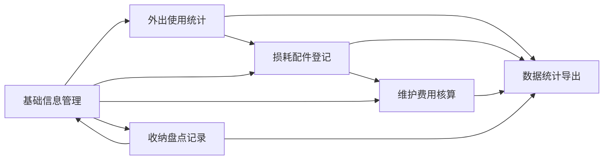

# 露营装备租赁台账管理系统 - 产品需求文档

## 1. 产品概述

露营装备租赁台账管理系统是一款面向露营装备租赁商家的全功能管理平台，旨在解决装备租赁过程中的信息分散、数据不同步、损耗难追踪等痛点问题。系统通过六大核心模块的互联互通，实现装备全生命周期的精细化管理。

- **核心价值**：提升装备管理效率、降低运营成本、实现数据驱动决策
- **目标用户**：露营装备租赁商家、户外俱乐部、团建活动组织者
- **核心定位**：专业、高效、可追溯的装备租赁台账管理工具

## 2. 核心功能

### 2.1 用户角色

| 角色 | 登录方式 | 核心权限 |
|------|----------|----------|
| 管理员 | 账号密码登录 | 全部功能管理、数据导出、系统配置 |
| 操作员 | 账号密码登录 | 基础信息维护、登记记录、查看统计 |

### 2.2 功能模块

1. **基础信息管理**：装备信息、客户信息、供应商信息的增删改查
2. **外出使用次数统计**：租赁记录管理、使用次数统计、租期追踪
3. **损耗配件登记**：装备损耗记录、配件更换登记、损耗趋势分析
4. **维护费用核算**：维护记录管理、费用统计、成本分析
5. **收纳盘点记录**：库存盘点、收纳管理、盈亏记录
6. **数据统计导出**：多维度报表、数据导出、可视化图表

### 2.3 页面详情

| 页面名称 | 模块名称 | 功能描述 |
|---------|---------|----------|
| 首页仪表盘 | 数据概览 | 核心指标卡片、趋势图表、快捷操作入口 |
| 基础信息管理 | 装备管理 | 装备列表、新增/编辑/删除装备、分类筛选 |
| 基础信息管理 | 客户管理 | 客户列表、新增/编辑/删除客户、联系方式 |
| 基础信息管理 | 供应商管理 | 供应商列表、新增/编辑/删除供应商 |
| 外出使用统计 | 租赁记录 | 租赁单列表、新增租赁、归还登记 |
| 外出使用统计 | 使用统计 | 使用次数排名、租期统计、热门装备 |
| 损耗配件登记 | 损耗记录 | 损耗列表、新增损耗登记、程度分级 |
| 损耗配件登记 | 配件管理 | 配件更换记录、配件库存 |
| 维护费用核算 | 维护记录 | 维护列表、新增维护、费用记录 |
| 维护费用核算 | 费用统计 | 月度费用、装备维护成本排名 |
| 收纳盘点记录 | 盘点管理 | 盘点单列表、新增盘点、盈亏记录 |
| 收纳盘点记录 | 库存概览 | 库存状态、位置管理 |
| 数据统计导出 | 综合报表 | 多维度统计、筛选条件、图表展示 |
| 数据统计导出 | 数据导出 | Excel/CSV导出、打印支持 |

## 3. 核心流程

### 3.1 装备租赁流程
用户从装备库选择装备 → 创建租赁订单 → 记录客户信息 → 装备出库 → 租期内使用追踪 → 归还验收 → 更新装备状态 → 完成订单

### 3.2 装备维护流程
发现装备损耗/故障 → 创建维护记录 → 记录维护费用和配件 → 维护完成验收 → 更新装备状态 → 计入维护成本

### 3.3 盘点流程
创建盘点任务 → 逐件清点装备 → 记录盘盈盘亏 → 生成盘点报告 → 更新库存数据

### 3.4 Mermaid 流程图

## 4. 用户界面设计

### 4.1 设计风格

- **主色调**：深森林绿 (#2D5A3D) - 传达自然、专业的露营主题
- **辅助色**：暖橙色 (#E87D3B) - 用于强调和交互元素
- **中性色**：以暖灰色系为主，营造温暖自然的氛围
- **按钮风格**：圆角中等，悬停有轻微上浮和阴影效果
- **字体**：标题使用思源宋体（Serif）传达稳重感，正文使用思源黑体（Sans-serif）保证可读性
- **布局风格**：左侧导航 + 顶部标题栏 + 主内容区的经典管理后台布局
- **卡片设计**：圆角卡片 + 柔和阴影 + 细微边框
- **图标风格**：使用 Lucide 线性图标，与整体简洁风格统一

### 4.2 页面设计概览

| 页面名称 | 模块名称 | UI 元素 |
|---------|---------|--------|
| 仪表盘 | 数据概览 | 渐变指标卡片、趋势折线图、环形占比图、快捷操作按钮 |
| 列表页面 | 通用列表 | 顶部筛选栏、数据表格、分页器、操作按钮组 |
| 表单页面 | 通用表单 | 分步表单、表单验证、提交/取消按钮 |
| 统计页面 | 数据可视化 | 多维度图表、数据筛选、钻取分析 |

### 4.3 响应式设计

- **桌面优先**：以 1440px 宽度为基准设计
- **平板适配**：1024px 宽度时导航折叠为图标模式
- **移动端适配**：768px 以下采用底部导航栏 + 纵向布局

### 4.4 动效设计

- 页面切换：淡入淡出 + 轻微位移
- 卡片悬停：上浮 2px + 阴影加深
- 数据加载：骨架屏 + 脉冲动画
- 按钮交互：缩放反馈 + 颜色渐变
