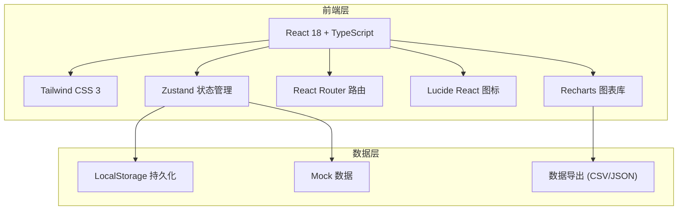
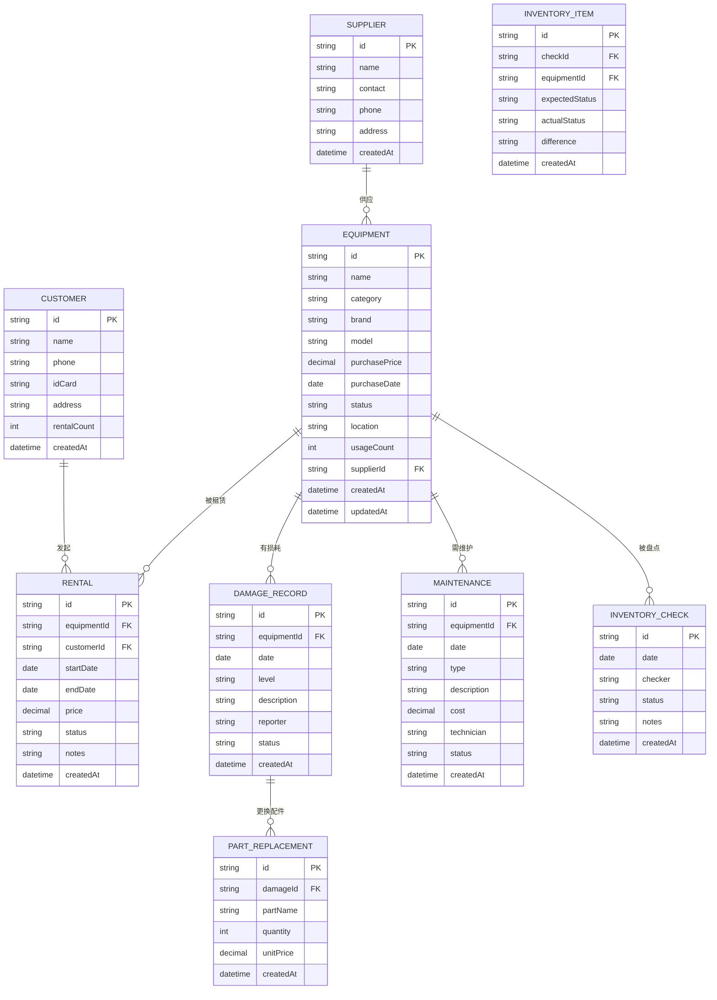

# 露营装备租赁台账管理系统 - 技术架构文档

## 1. 架构设计



## 2. 技术栈说明

- **前端框架**：React@18 + TypeScript
- **构建工具**：Vite@5
- **样式方案**：Tailwind CSS@3
- **状态管理**：Zustand
- **路由管理**：React Router DOM@6
- **图标库**：Lucide React
- **图表库**：Recharts
- **数据持久化**：LocalStorage
- **包管理器**：npm

## 3. 路由定义

| 路由路径 | 页面名称 | 说明 |
|---------|---------|------|
| `/dashboard` | 仪表盘 | 数据概览、快捷操作 |
| `/equipment` | 装备管理 | 装备列表、新增/编辑/删除 |
| `/customers` | 客户管理 | 客户列表、新增/编辑/删除 |
| `/suppliers` | 供应商管理 | 供应商列表、新增/编辑/删除 |
| `/rentals` | 租赁记录 | 租赁订单管理、归还登记 |
| `/usage-stats` | 使用统计 | 使用次数、租期统计 |
| `/damage` | 损耗登记 | 损耗记录、配件更换 |
| `/maintenance` | 维护管理 | 维护记录、费用统计 |
| `/inventory` | 收纳盘点 | 盘点记录、库存管理 |
| `/reports` | 数据报表 | 综合统计、数据导出 |

## 4. 数据模型

### 4.1 ER 图



### 4.2 状态说明

**装备状态 (EquipmentStatus)**
- `available` - 在库可用
- `rented` - 已租出
- `maintenance` - 维护中
- `damaged` - 损坏待修
- `scrapped` - 已报废

**租赁状态 (RentalStatus)**
- `pending` - 待取货
- `active` - 租赁中
- `returned` - 已归还
- `overdue` - 已逾期
- `cancelled` - 已取消

**损耗程度 (DamageLevel)**
- `minor` - 轻微
- `moderate` - 中等
- `severe` - 严重

## 5. 项目结构

```
src/
├── components/          # 通用组件
│   ├── Layout/         # 布局组件
│   ├── Table/          # 表格组件
│   ├── Modal/          # 弹窗组件
│   ├── Form/           # 表单组件
│   └── Card/           # 卡片组件
├── pages/              # 页面组件
│   ├── Dashboard/      # 仪表盘
│   ├── Equipment/      # 装备管理
│   ├── Customers/      # 客户管理
│   ├── Suppliers/      # 供应商管理
│   ├── Rentals/        # 租赁记录
│   ├── UsageStats/     # 使用统计
│   ├── Damage/         # 损耗登记
│   ├── Maintenance/    # 维护管理
│   ├── Inventory/      # 收纳盘点
│   └── Reports/        # 数据报表
├── store/              # Zustand 状态管理
│   ├── useEquipmentStore.ts
│   ├── useCustomerStore.ts
│   ├── useRentalStore.ts
│   ├── useDamageStore.ts
│   ├── useMaintenanceStore.ts
│   └── useInventoryStore.ts
├── types/              # TypeScript 类型定义
│   └── index.ts
├── utils/              # 工具函数
│   ├── format.ts       # 格式化工具
│   ├── export.ts       # 导出工具
│   └── mock.ts         # Mock数据
├── hooks/              # 自定义 Hooks
├── App.tsx             # 根组件
├── main.tsx            # 入口文件
└── index.css           # 全局样式
```

## 6. 核心功能实现方案

### 6.1 数据互通机制

通过 Zustand 集中管理状态，各模块共享同一份数据源：
- 租赁模块更新装备状态和使用次数
- 损耗模块关联装备记录，影响装备状态
- 维护模块关联损耗记录，更新维护费用
- 盘点模块读取装备库存，记录盈亏

### 6.2 全程留痕实现

- 所有记录包含 `createdAt`、`updatedAt` 时间戳
- 重要操作记录操作人信息
- 状态变更保留历史记录
- 数据修改可追溯

### 6.3 数据导出功能

- 支持 CSV 格式导出
- 支持 JSON 格式导出
- 支持筛选条件导出
- 支持按时间范围导出
